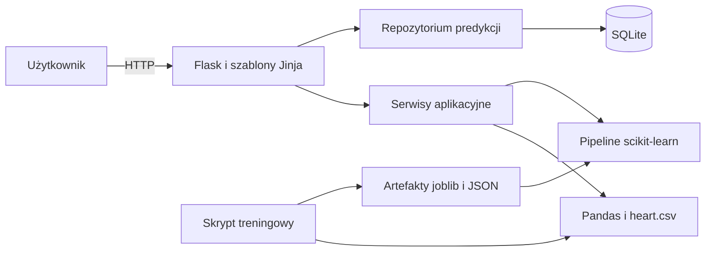
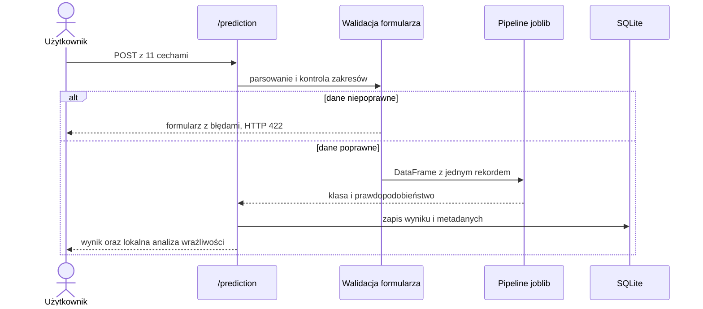

# Architektura aplikacji

## Podział odpowiedzialności

Projekt rozdziela interfejs WWW, logikę uczenia maszynowego i trwały zapis
danych. Dzięki temu pipeline można trenować i testować bez uruchamiania Flask,
a warstwa webowa nie zawiera szczegółów preprocessingu.

### Warstwy

| Warstwa | Katalog | Odpowiedzialność |
| --- | --- | --- |
| Routing | `app/*/routes.py` | obsługa żądań i wybór szablonu |
| Prezentacja | `app/templates`, `app/static` | HTML, Bootstrap, Plotly i CSS |
| Serwisy | `app/services` | przygotowanie danych dla widoków i predykcja |
| Repozytorium | `app/repositories` | zapytania i transakcje SQLAlchemy |
| Modele bazy | `app/models` | definicja schematu SQLite |
| Machine learning | `cardio_ml` | walidacja danych, preprocessing, trening i ocena |
| Polecenia | `scripts` | audyt datasetu i odtwarzalny trening |

## Przepływ treningu

1. `scripts/train_models.py` wywołuje moduł `cardio_ml.training`.
2. Dataset jest walidowany i dzielony stratyfikowanie na część treningową oraz
   testową.
3. Każdy klasyfikator otrzymuje ten sam schemat preprocessingu.
4. GridSearchCV wybiera konfigurację na podstawie ROC AUC z walidacji
   krzyżowej części treningowej.
5. Zamrożone konfiguracje są oceniane na nietkniętym zbiorze testowym.
6. Najlepsza konfiguracja według wyniku CV jest trenowana na pełnym datasecie.
7. Pipeline, wyniki i metadane są zapisywane w katalogu `artifacts`.

## Przepływ predykcji

Jeśli zapis w SQLite się nie powiedzie, transakcja jest wycofywana, natomiast
obliczony wynik pozostaje widoczny wraz z komunikatem o błędzie historii.

## Schemat SQLite

Tabela `prediction_records`:

| Kolumna | Typ | Znaczenie |
| --- | --- | --- |
| `id` | INTEGER, PK | identyfikator techniczny |
| `created_at` | DATETIME, indeks | czas wykonania predykcji |
| `predicted_class` | INTEGER | klasa 0 lub 1 |
| `probability` | FLOAT | prawdopodobieństwo klasy 1 |
| `threshold` | FLOAT | próg klasyfikacji |
| `model_name` | VARCHAR | czytelna nazwa modelu |
| `model_version` | VARCHAR | wersja artefaktu |
| `input_data` | JSON | 11 parametrów formularza |
| `explanation_data` | JSON | zapis lokalnej analizy wrażliwości |

Ograniczenia `CHECK` pilnują klas oraz zakresu prawdopodobieństwa i progu.
Indeks na `created_at` wspiera sortowanie historii od najnowszych rekordów.

## Decyzje projektowe

- Fabryka `create_app()` pozwala przekazać osobną konfigurację w testach.
- Jeden pipeline joblib obejmuje preprocessing i klasyfikator, co ogranicza
  ryzyko rozbieżności między treningiem a predykcją.
- SQLite wystarcza dla lokalnej aplikacji akademickiej i nie wymaga osobnego
  serwera bazy danych.
- JSON zachowuje dokładny zestaw wejść oraz wyjaśnień dla każdej historycznej
  predykcji.
- `db.create_all()` upraszcza pierwsze uruchomienie. Przy późniejszych zmianach
  schematu należałoby dodać migracje, np. Alembic lub Flask-Migrate.
